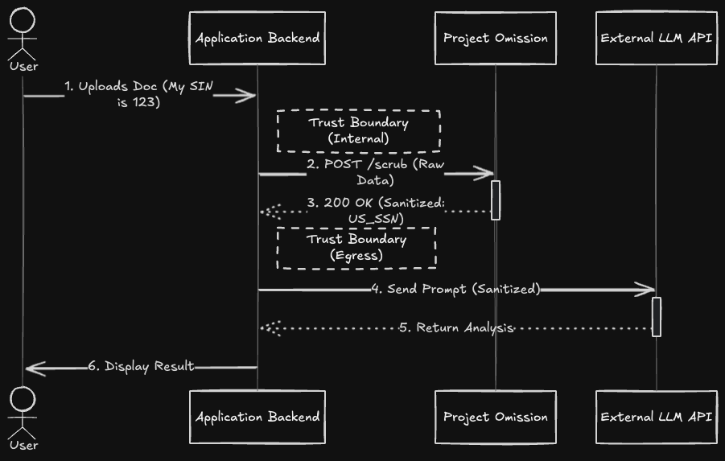

# Problem
FinTech applications increasingly rely on LLMs for features like document summarization and grant application assistance. However, sending raw student data (Names, SINs, Financials) to third-party providers (OpenAI, Anthropic) creates significant compliance and privacy risks.

As per **OWASP Top 10 for LLM Applications 2025**, failing to sanitize this data results in *LLM02:2025 Sensitive Information Disclosure*. 


# The Solution: "Sanitize First, Inference Second"
Project Omission acts as a proxy layer between the frontend client and the LLM. It uses Natural Language Processing (NLP) to contextually identify PII and replace it with entity tags.

### Key Features
*   **Context-Aware Scrubbing:** Uses **Microsoft Presidio** (backed by `spaCy` en_core_web_lg) to distinguish between "Call me at 555-0199" (Phone) and "Ticket #5550199" (Non-PII).
*   **Stateless Architecture:** No data persistence. Processed in-memory.
*   **Strict Validation:** Uses **Pydantic** to enforce strict input/output contracts.
*   **Containerized:** Deploys as a Docker microservice.

---

## OWASP 2025 Coverage
This project  mitigates the following risks from the [OWASP Top 10 for LLM Applications 2025 (Latest)](https://genai.owasp.org/):

| ID | Vulnerability | How Project Omission Mitigates |
| :--- | :--- | :--- |
| **LLM02** | **Sensitive Information Disclosure** | **Direct Mitigation.** By scrubbing PII *before* the prompt leaves the secure enclave, we prevent sensitive data from entering the model provider's logs or training data. |
| **LLM08** | **Vector and Embedding Weaknesses** | **preventative.** Ensures that PII is not embedded into Vector Databases (RAG), preventing cross-tenant data leakage or retrieval of secrets via semantic search. |
| **LLM10** | **Unbounded Consumption** | **Partial.** Enforces strict token/character limits (`max_length=5000`) on inputs to prevent DoS via massive payload injections. |

## Architecture



1.  **Ingest:** API receives raw text payload via `POST /api/v1/scrub`.
2.  **Analyze:** Presidio Analyzer identifies entities (SSN, CREDIT_CARD, EMAIL).
3.  **Anonymize:** Entities are replaced with distinct tags `<ENTITY_TYPE>` to preserve grammatical context for the LLM.
4.  **Forward:** The sanitized string is returned to the application for safe inference.

Quick Start (Docker)

Prerequisites: Docker Desktop.

```bash
# 1. Build the image (includes baking in the NLP model)
docker build -t project-omission .

# 2. Run the container
docker run -p 8000:8000 project-omission

# Roadmap
1. Canadian SIN Support: Implement a way to validate Canadian Social Insurance numbers.
